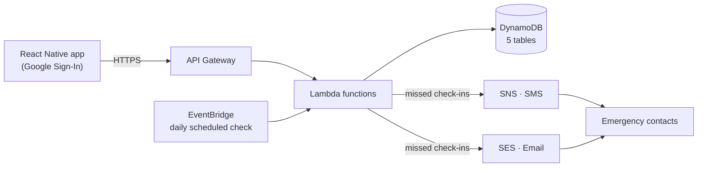

# Are You Safe?

[](https://reactnative.dev)
[](https://www.typescriptlang.org)
[](https://aws.amazon.com/lambda)
[](LICENSE)

A daily safety check-in app for the Indian audience.

The user opens the app and presses "I am safe" once a day. If they stop checking in for a configurable number of days (default: 2), the backend automatically alerts their pre-configured emergency contacts via SMS and email so someone knows to follow up.

Useful for elderly people living alone, anyone with a medical condition, solo travellers, and anyone who wants a simple dead-man's-switch style safety net.

## Status

This is an archived snapshot of the project. The AWS backend has been torn down, so the app will not run end-to-end against a live server without redeploying the Lambda functions yourself. The mobile and backend source remain here as a reference implementation.

## How it works



End-to-end flow:

1. User signs in with Google.
2. App sends the Google ID token to `POST /auth/google`. Backend verifies it, creates or updates the user in DynamoDB, returns a JWT access token + refresh token.
3. App stores the JWT in AsyncStorage. All subsequent calls send `Authorization: Bearer <token>`.
4. User presses "I am safe" -> `POST /checkin` -> backend records the date in DynamoDB.
5. An EventBridge cron triggers the `ays-monitor` Lambda every hour. It scans all users; for anyone past their configured threshold, it invokes `ays-sendAlert` once per emergency contact.
6. `ays-sendAlert` sends SMS via SNS and email via SES.

## Tech stack

**Mobile (React Native 0.83 / TypeScript)**
- React 19, React Navigation v7 (native stack + bottom tabs)
- Google Sign-In via `@react-native-google-signin/google-signin`
- Local notifications via `@notifee/react-native` with an "I am safe" action button on the daily reminder so the user can check in without opening the app
- `axios` for API calls, `@react-native-async-storage/async-storage` for token + offline state
- `react-native-config` for environment-specific API endpoints
- An offline queue that retries check-ins when connectivity returns

**Backend (AWS serverless, Node.js 20.x)**
- API Gateway (REST) -> Lambda for every endpoint
- DynamoDB for users, sessions, contacts, check-ins, alert history
- SNS for SMS, SES for email
- EventBridge for the hourly monitor
- `google-auth-library` server-side token verification, `jsonwebtoken` for app sessions

**Android native (Kotlin)**
- A home-screen widget with a single "I am safe" button so the user can check in directly from their launcher

## Repository layout

```
.
+-- src/                  React Native source (screens, services, navigation, context)
+-- android/              Android native project + Kotlin widget
+-- ios/                  iOS Xcode project
+-- backend/              AWS Lambda handlers, deploy scripts
+-- legal-pages/          Static privacy + terms pages (Firebase Hosting)
+-- App.tsx               App root
+-- index.js              RN entry + background notification handler
```

## Running the mobile app locally

Prerequisites: Node 20+, JDK 17, Android Studio (for the Android build), Xcode (for the iOS build).

```sh
npm install
```

Set up a `.env` (and `.env.development` / `.env.staging` / `.env.production` as you need them):

```
API_BASE_URL=...
GOOGLE_WEB_CLIENT_ID=...
GOOGLE_ANDROID_CLIENT_ID=...
ENVIRONMENT=development
AWS_REGION=ap-south-1
```

Then:

```sh
npm start                              # Metro
npm run android                        # Android
# iOS: bundle install && bundle exec pod install (in ios/), then:
npm run ios
```

Without the AWS backend running, sign-in and check-in API calls will fail. The local UI flow still works for inspection.

## Deploying the backend

`backend/` contains the Lambda handlers and a deploy script that packages each function and pushes it to AWS. You will need:

- An AWS account with Lambda, API Gateway, DynamoDB, SNS, SES, and EventBridge access
- A Google OAuth client (Web + Android)
- An SES sender identity verified in your region
- DynamoDB tables: `ays-users`, `ays-sessions`, `ays-contacts`, `ays-checkins`, `ays-alerts`

The deploy scripts assume `ap-south-1` (Mumbai); the region is configurable via env.

## Key design decisions

**Why an explicit "I am safe" press instead of inferring activity from sensors?** Inferring liveness from phone activity (steps, screen unlocks, location pings) sounds cleaner but has two failure modes. First, false negatives: an elderly person reading on the couch all day produces almost no signal — the alarm fires when nothing is wrong. Second, false positives: a phone left charging on a table accumulates "activity" from background processes — the alarm doesn't fire even when the user has been unresponsive for two days. An explicit user action is the only signal that means what it says.

**Why a home-screen widget in addition to the in-app button?** Friction matters. The whole proposition is "once a day, two seconds." If the user has to unlock the phone, find the app, wait for it to open, then tap the button, the daily compliance rate drops. A widget makes the action one tap from the launcher.

**Why React Native rather than fully native?** The app's UI is genuinely simple — three screens, a button, a list of contacts. The hard part is the daily-notification background reliability, which on Android needs a foreground service and on iOS needs careful UNUserNotificationCenter handling. React Native + `@notifee/react-native` covers both with one codebase, while exposing the native modules I needed (Android widget in Kotlin) without forcing a rewrite of the whole app.

**Why AWS Lambda + DynamoDB instead of a single EC2 + Postgres?** The traffic profile is bursty and tiny: most users send one check-in per day, plus the hourly monitor cron. A single EC2 instance idles 95% of the time but still costs money; Lambda pricing rounds to zero. DynamoDB likewise: the access pattern is "lookup by user_id" and "scan-for-overdue-users in the cron" — both fit DynamoDB's GSI model exactly, without the operational overhead of a managed Postgres.

**Why SNS for SMS instead of Twilio?** SNS SMS is significantly cheaper in `ap-south-1` (Mumbai) for India-bound numbers, and the deliverability is comparable for transactional messages. Twilio has a richer feature set, but for "send this single line of text once when an alarm fires," SNS is the right cost point.

**Why a configurable threshold (default 2 days) rather than fixed 24 hours?** A 24-hour threshold has too many false alarms — people travel, sleep through, or forget once. Two days is the empirical sweet spot for "the user is probably fine but someone should check." Users with medical conditions or higher risk can drop it to 1; solo travellers on a long expedition might want 5.

## Known limitations

- **Hourly cron granularity.** EventBridge fires `ays-monitor` once per hour. An alarm condition that becomes true at minute 0 of an hour can take up to 59 minutes to fire. Fine for "did the user check in today?" — would not be fine for medical-grade liveness.
- **No clinician/responder integration.** Alerts go to the user's pre-configured personal contacts, not to any emergency service. By design — false-positive alerts to 108/911 would be a bad outcome — but it means the value of the system is gated on the user actually having reachable emergency contacts.
- **Single language.** UI strings are English-only. For the elderly Indian user this app is partly aimed at, that's a real adoption barrier.
- **No "stop the alarm from where I am right now" path.** Once `ays-monitor` decides the threshold is hit, the alert sends. A user who is genuinely fine and just forgot to check in has no way to abort the outbound SMS in the small window before it goes — only a way to check in afterwards.
- **No clinician/end-user testing.** The app was built and run against my own daily check-in pattern. It has not been validated with the actual target demographic.

## License

MIT.
